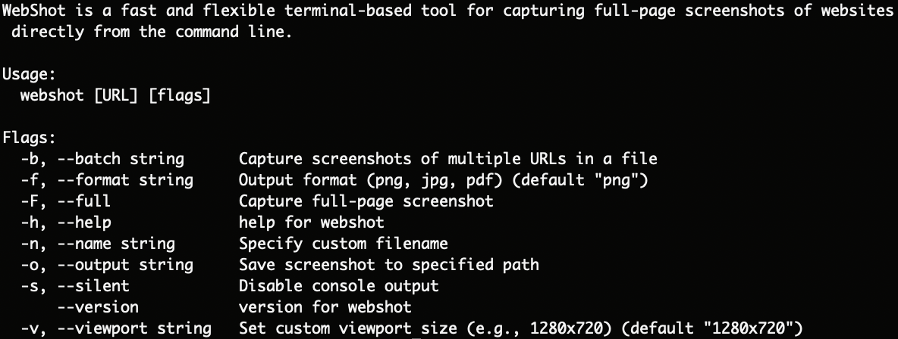

# WebShot

**WebShot** is a fast and flexible terminal-based tool for capturing full-page screenshots of websites directly from the command line. Perfect for developers, designers, QA testers, and archivers.



## 🔧 Features

- 🌐 Capture full-page or viewport-only screenshots from any URL
- 🧾 Save with custom filename or auto-named by domain/date
- 🎛️ Multiple output formats (PNG, JPEG, PDF)
- 🧪 Batch mode for multiple URLs
- 📂 Custom output directories
- 🖥 macOS-native notifications (optional)
- 🕶 Headless Chromium support
- 🧩 Easy integration with cron or automation scripts

## 🚀 Installation

```bash
brew install webshot
# or clone and build manually
git clone https://github.com/makalin/webshot.git
cd webshot
make install
````

## 💻 Usage

```bash
webshot https://example.com
```

### Arguments

| Argument            | Description                                    |        |                              |
| ------------------- | ---------------------------------------------- | ------ | ---------------------------- |
| `--output <path>`   | Save screenshot to specified path              |        |                              |
| \`--format \<png    | jpg                                            | pdf>\` | Output format (default: png) |
| `--full`            | Capture full-page screenshot                   |        |                              |
| `--viewport <WxH>`  | Set custom viewport size (e.g., 1280x720)      |        |                              |
| `--batch <file>`    | Capture screenshots of multiple URLs in a file |        |                              |
| `--name <filename>` | Specify custom filename                        |        |                              |
| `--silent`          | Disable console output                         |        |                              |

### Example

```bash
webshot https://github.com --full --output ./shots/ --format pdf
```

## 📦 Dependencies

* Chromium or Chrome installed
* Node.js / Go / Rust / Python (depending on your implementation)

## 🛠 Developer Notes

Planned features:

* Auto-thumbnail generation
* Screenshot diff for visual regression
* Markdown report mode
* S3 upload support

## 🤝 Contributing

Pull requests and feature suggestions are welcome!

1. Fork the repo
2. Create your branch (`git checkout -b feature/foo`)
3. Commit your changes
4. Push and open a PR

## 📄 License

MIT © [Mehmet T. AKALIN](https://github.com/makalin)

---

> Built with love for terminal minimalists who still love visuals.
